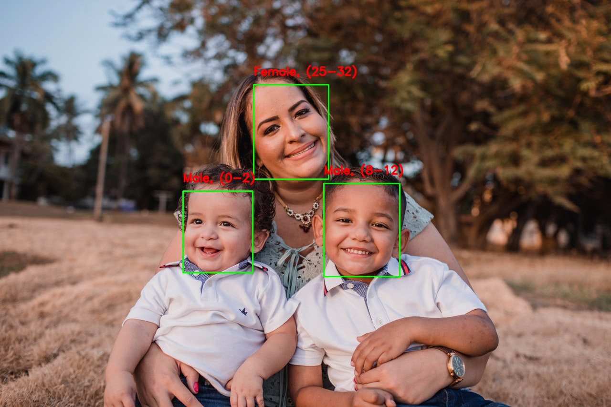

# Gender and Age Classification using OpenCV Deep Learning ( C++/Python )


## Run Code

### C++
```
cmake .
make
./AgeGender <input_file>(Leave blank for webcam)
```

### Python
```
python AgeGender.py --input <input_file>(Leave blank for webcam)
```

## Sample Result




